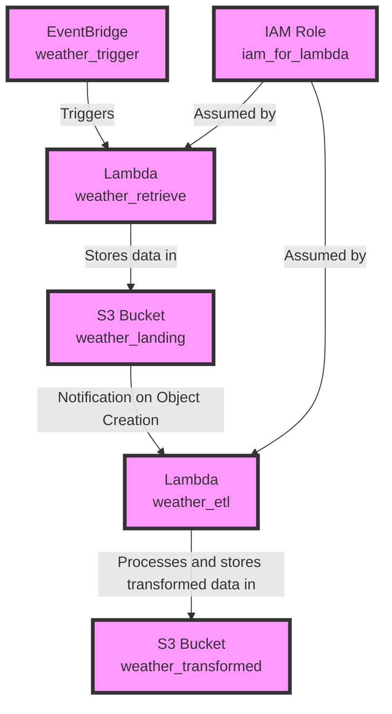

# Terraform AWS Infrastructure

Terraform code that will take the components of a python ETL pipeline and deploy it to AWS services.

## Prerequisites

- AWS Account
- Terraform installed
- AWS CLI installed and configured

- ## Infrastructure Diagram

