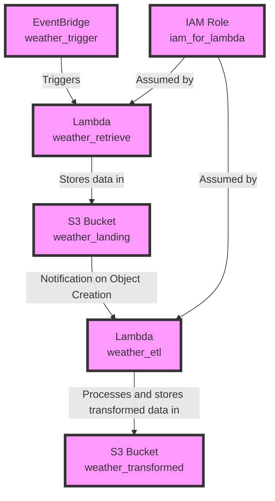

# Terraform AWS Infrastructure

Terraform code that will take the components of a python ETL pipeline and deploy it to AWS services.

## Prerequisites

- AWS Account
- Terraform installed
- AWS CLI installed and configured

- ## Infrastructure Diagram

- ## Infrastructure Diagram
### Structuring the Files
The files are organised based on their purpose and content:

**main.tf:** This file acts as the entry point of the Terraform module. It includes the provider configuration and any resource that doesn't fit neatly into other categories. It's the module should be initiated from with provider specifics.
**variables.tf:** This file declares variables that will be used across multiple resources or modules. Declaring variables here allows for easier customisation of the Terraform configurations without hardcoding values into the resource configurations.
**locals.tf:** This file defines local values that are meant to be reused within the module. Locals can help avoid repetition and make the configuration more readable.
**iam.tf, lambda.tf, eventbridge.tf, s3_buckets.tf:** These files contain resources related to their namesakes. Splitting resources into separate files by their functionality or service type helps keep the configuration organised.